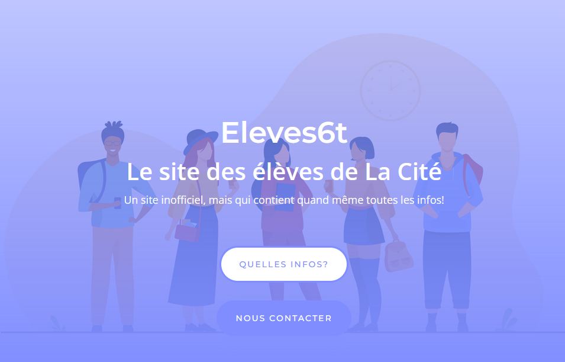

# Eleves6t

  

    
    
    

Eleves6t was formerly an unofficial organization of students of the [Gymnase de La Cité](https://www.gymnasecite.ch/) whose goal was mainly to spread information among the students about student-driven projects or events, in particular with [Eleves6t's website](https://www.eleves6t.ch).

    

Just like the [Podcast de La Cité](https://github.com/PodcastDeLaCite), Eleves6t stopped existing when the students composing it graduated, with no one to take their place.

The website is now part of [Maël Imhof](https://github.com/MaelImhof)'s portfolio, as no one uses it.